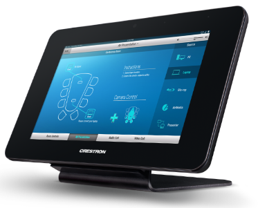

快思聪宣布最新的TST-902 8.9吋触摸屏正式上架。快思聪将TSW系列的众多功能融合到TST-902，提供更稳定的无线控制体验。每一部9吋的电容式无线触摸屏皆由强大的Smart Graphics™支持，代表着可靠丶安全的无线控制以及一致丶直观的使用者体验。TST\-902通过优先选用ER无线通信来进行控制以减少使用Wi-Fi®。

\[caption id="attachment\_448" align="aligncenter" width="373"\] 快思聪TST-902无线触摸屏\[/caption\] **9****吋无线触摸屏上的专业控制**

TST-902用上快思聪独有的Smart Graphics，演绎出多个鲜明夺目的介面。电容式超明亮宽萤幕显示丶H.264串流视讯技术配上超薄边框绝对能带来巧妙绝伦的崭新体验。

**高速丶稳妥丶安全的全能表现**

TST-902以ER为基础通信模式，提供高速无线通信。ER无线通信经高性能电源RF网关(CEN-ERFGW-POE)可覆盖室内无线通信范围高达200尺。用户亦可自由选用ER为单一通信模式，或双式通信 (ER及Wi\-Fi)来观看IP摄像机的视频和浏览互联网。

**超长电池寿命**

TST-902使用新式锂电池，更有效地快速充电，即便设备长期放置在底座上亦不会对电池造成损耗。为进一步延长电池寿命，更采用Instant-Waking®技术，闲置设备会在数秒内转为待机模式，处於低耗电状态；要「唤醒」设备亦无须等候，只要提起或轻点萤幕即可。锂电池可因应需要随时自行更换，提高设备的灵活性。

**更时尚丶型格的充电配套**

为配合不同会议室的设计需要，TST-902可与挂墙配件或桌面底座自由组合，使「实用」与「美学」两者兼得，这两款配件可直接作为充电底座，设计更简洁，用途更广泛。
