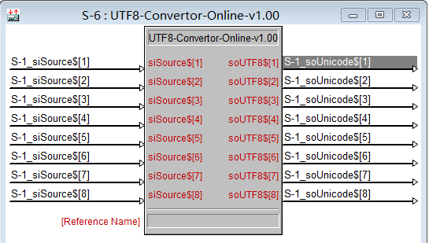

出于 simpl windows 程序里面中文字符发送给 ipad 这类的触摸屏导致中文乱码的问题而写的程序, 主机内进行字符编码转换麻烦而且占用系统资源, 因些采用在线式转换. 当然需要保持网络在线.

写程序的时候难免碰到需要给触摸屏发送字符, 那么肯定也不全是英文字符, 给触摸屏发送中文我想你可以看到那些我猜大概是它认识你你不认识它的字符吧, 怎么办呢? 那么转吧, 即然不认识就转成认识的吧.

这时, 你可能需要这个程序(宏: UTF8-Convertor-Online)来帮你解决问题, 程序截图: 

支持 999 个信号输入输出. 她能做什么呢?

比如:

把"你国"转换为"&#x4F60;&#x56FD;"

可能你要说这个我看不懂, 我想说没事, 请到触摸屏上面看. XD...

然后, 你需要保持网络畅通. 然后的然后, 目前转换的服务器是本网站.

程序下载: 百度网盘: [http://pan.baidu.com/s/1qWzd9O4](http://pan.baidu.com/s/1qWzd9O4) 提取码：l86u

如果你有下载试用,  可以在留言栏里面反馈,  或是发邮件到 \[email\]support@apcube.com\[/email\].

测试环境:

> Crestron Software:
> 
> Crestron Core 3 UI Controls........: 2.07.07.01 Crestron Database..................: 52.00.016.00 Crestron Toolbox...................: 2.40.325.00 Device Database....................: 66.05.002.00 SIMPL Windows......................: 4.03.10.00 SIMPL Windows Library..............: 508 SIMPL+ Cross Compiler..............: 1.3 VisionTools Pro-e..................: 5.9.05.04
> 
> Crestron Device:
> 
> Device Name........................: AV3 Version............................: 1.010.0060 TouchPanel.........................: iPhone5(iOS 8.4.1) CrestronAPP(ver: 1.04.50)
> 
> Operating System:
> 
> Windows Version: Microsoft Windows 8.1 专业版 IE Version: 9.11.9600 CPU: Intel(R) Core(TM) i5-2410M CPU @ 2.30GHz (x4) @ 2293 MHz Physical Memory: 725 MB / 2988 MB Virtual Memory: 1926 MB / 2047 MB Admin Rights: Yes DPI: X:96 Y:96 Scaling Factor: 100

版本历史: v1.00 实现基本转换功能.

v1.01 更换转换服务器地址。
