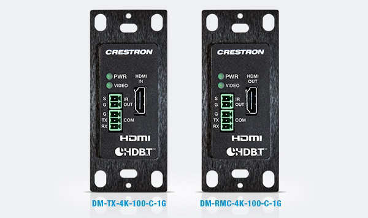

快思聪为各方专业AV人员带来了业界首个简洁高效、低成本4K信号处理的一体化解决方案 ──4K DM 8G+®传送器墙面板100 (DM-TX-4K-100-C-1G)以及4K DM 8G+®墙面接收器及房间控制(DM-RMC-4K-100-C-1G)，两款新产品均载有串行和IR接口，方便连接其他控制设备，更快速有效地传送4K信号、连接4K显示屏同时控制更多相连的设备。

DM-TX-4K-100-C-1G和DM-RMC-4K-100-C-1G将分别取代DM-TX1-C-1G和DM-RX1-C-1G，兼容HDBaseT®规格，更清晰易用的信号界面适用於连接单个高清或4K超高清显示屏，建构完整的DM控制系统。

**简洁、朴素的使用者界面** 两款4K新产品采用标准单组接线盒设计，备有黑、白两色，可自由选用原厂附设的电源供应配件或透过PoDM供电，无需使用特別接线盒或线材，只要接上標準线材即可使用。整个传送/接收器可完全被隐藏於墙内，只有一条HDMI®线材外露，大大减低对整体外观的影响，配合轻薄的4K显示屏一同使用，尤其合适现今追求简洁舒适的室内布置。

**会议空间的理想选择** DM-TX-4K-100-C-1G和DM-RMC-4K-100-C-1G同时适用於宴会厅、酒店、会议中心等设有房间分隔系统的地点。为适应不同的空间布置，这些地点一般都会将多个传送器、接收器隐藏於墙面或地板接线箱内，并改用更具流动性的活动支架来支撑显示屏，接上所需线材後即可更灵活自主的配合不同空间布置的需要。

**不局限于4K** 任何一款传送/接收器只需透过一条简单的线材就能连接DM切换器，一切音/视频传送、接收、控制、联网、供电都可在这单一线材上实现。机上的HDMI输入接口和输出接口均支持4K (4096x2160)分辨率的视频传送，也可直接接驳HDBaseT显示屏，无需加入转换器和接收器。

**内置控制功能** 每套快思聪智能系统都是为了提供最精确的控制和流畅的使用者体验而设。DM-TX-4K-100-C-1G和DM-RMC-4K-100-C-1G内置串行和IR接口，可透过编程操控相连的显示屏或设备如摄像机和Blu-ray™播放器。当然，编程人员仍可沿用传统的CEC操控方式。

当DM-RMC-4K-100-C-1G连接到快思聪控制系统後，无需额外加入特定的控制线或IR发射器仍可控制房间内的显示屏。
