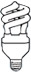

<table border="0" width="100%" cellspacing="0" cellpadding="0"><tbody><tr><td id="MSOZoneCell_WebPartWPQ1" valign="top"><table class="s4-wpTopTable" border="0" width="100%" cellspacing="0" cellpadding="0"><tbody><tr><td valign="top">

选择合适的灯泡意味着要平衡节能、舒适性、使用寿命、成本和兼容性。家里或办公室的每个区域需要使用不同类型的灯，因此存在不同的节能机会。

</td></tr></tbody></table>

</td></tr><tr><td id="MSOZoneCell_WebPartWPQ2" valign="top"><table class="s4-wpTopTable" border="0" width="100%" cellspacing="0" cellpadding="0"><tbody><tr><td valign="top">
<table border="0" cellspacing="0" cellpadding="0"><tbody><tr><td align="left" valign="top"></td><td align="left" valign="top"><h5 class="helv13222">白炽灯泡</h5>白炽灯泡能提供温暖充足的灯光质量、良好的色彩体现和可控性，但效率最低。</td></tr></tbody></table>
</td></tr></tbody></table>

</td></tr><tr><td id="MSOZoneCell_WebPartWPQ3" valign="top"><table class="s4-wpTopTable" border="0" width="100%" cellspacing="0" cellpadding="0"><tbody><tr><td valign="top">
<table border="0" cellspacing="0" cellpadding="0"><tbody><tr><td align="left" valign="top"></td><td align="left" valign="top"><h5 class="helv13222">螺旋式CFL灯泡</h5>螺旋式CFL灯泡效率最高，是所有灯泡中寿命最长的灯泡，但这种灯泡发出的光舒适度较低，启动慢，可能会闪烁，并且由于含汞而不能随意处置。</td></tr></tbody></table>
</td></tr></tbody></table>

</td></tr><tr><td id="MSOZoneCell_WebPartWPQ4" valign="top"><table class="s4-wpTopTable" border="0" width="100%" cellspacing="0" cellpadding="0"><tbody><tr><td valign="top">
<table border="0" cellspacing="0" cellpadding="0"><tbody><tr><td align="left" valign="top"></td><td align="left" valign="top"><h5 class="helv13222">卤素灯泡</h5>卤素灯泡是一种高效率的白炽灯，效率比传统的白炽灯泡高30%。在调光30%时，这类灯泡既具有CFL的优点又没有标准白炽灯的缺点。</td></tr></tbody></table>
</td></tr></tbody></table>

</td></tr><tr><td id="MSOZoneCell_WebPartctl00_ctl28_g_87faaceb_36ee_4929_873b_836892dcd58c" valign="top"><table class="s4-wpTopTable" border="0" width="100%" cellspacing="0" cellpadding="0"><tbody><tr><td valign="top"></td></tr></tbody></table>

</td></tr><tr><td id="MSOZoneCell_WebPartWPQ5" valign="top"><table class="s4-wpTopTable" border="0" width="100%" cellspacing="0" cellpadding="0"><tbody><tr><td valign="top">
<h4>一般原则</h4><h5 class="helv13222">在以下地方使用带调光器的卤素灯：</h5><ul class="bulleted_tight"><li>照明质量非常重要</li><li>您需要节能的环境</li><li>您想通过调光器、定时器或传感器来控制照明</li></ul><h5 class="helv13222">在以下地方使用可能配有调光器的CFL灯泡：</h5><ul class="bulleted_tight"><li>照明质量并不重要</li><li>不会有儿童或动物打破灯泡的危险</li><li>您想要最大的灯光，同时耗能又最小</li><li>您不需要传感器或定时器</li></ul>
</td></tr></tbody></table></td></tr></tbody></table>
