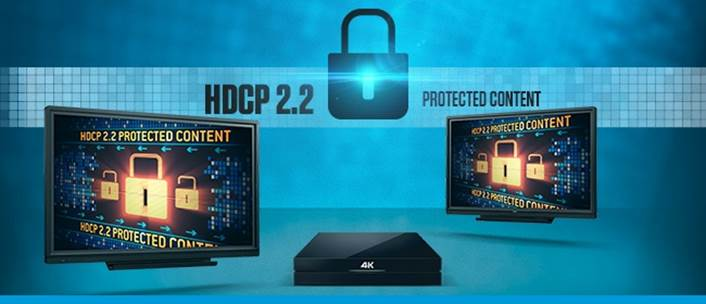

**DM®产品让您更得心应手的管理数字版权和分配受保护的4K内容** 快思聪发布5款兼容HDCP2.2 (高宽带数字内容保护协议) 技术的DigitalMedia™输入、输出卡，升级DM系统、传输HDCP2.2保护的4K视频内容变得更容易。 要传送受HDCP2.2保护的4K内容，必须进行系统升级，不仅需要更新固件，还需要采用新的硬件整体配合。令整个行业都振奋至极的是，快思聪早已「预见」了这场AV领域的技术革新风暴，而DM正是系统改革的标杆，代表行业最领先的数字技术。快思聪的4K分配解决方案已可完全支持HDCP2.2保护技术，集成商可从容应对系统升级的需求。 支持HDCP2.2的端对端解决方案 面对技术需求的提升，快思聪已推出了一系列支持HDCP2.2的DM产品，有助於数字版权管理(DRM)及分配受保护的4K内容。DM机座丶线材丶房间处理器及接收器等都符合HDCP2.2要求。 升级更容易 只要将目前安装的DM输入卡换成兼容HDCP2.2的DM输入卡和对应显示器的输出卡，即能完成升级，真正执行高宽带数字内容保护这项新标准。

5款支持HDCP2.2 4K DM输入/输出卡现已供货，详列如下： l DM 切换器配置的4K HDMI® 输入卡([DMC-4K-HD-HDCP2](http://crestron.com/products/model/DMC-4K-HD)) l DM 切换器配置的4K HDMI® 输入卡 (支持DSP) ([DMC-4K-HD-DSP-HDCP2](http://crestron.com/products/model/DMC-4K-HD-DSP)) l 为DM切换器配置的HDBaseT®认证 4KDM 8G+™ 输入卡 ([DMC-4K-C-HDCP2](http://crestron.com/products/model/DMC-4K-C)) l 为DM切换器配置的HDBaseT®认证 4K HDMI® 输入卡(支持DSP) ([DMC-4K-C-DSP-HDCP2](http://crestron.com/products/model/DMC-4K-C-DSP)) l DM切换器2路4K DM 8G+™ 输出卡 ([DMC-4K-CO-HD-HDCP2](http://crestron.com/products/model/DMC-4K-CO-HD))
