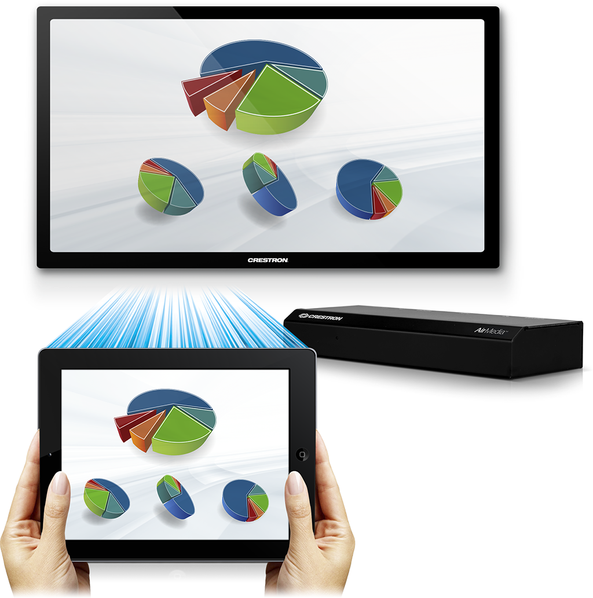

The [AirMedia (AM-100)](http://www.crestron.com/resources/product_and_programming_resources/catalogs_and_brochures/online_catalog/default.asp?jump=1&model=AM-100) is a device which allows users to present their HD content to projectors and displays using the existing IT infrastructure, without the hassle of connecting wires. It is a small network device with a single 10/100 megabit Ethernet port. Windows® and OS X® users can share their desktop by running a small application (no installation required). iOS® and AndroidTM users can also share Excel®, Word, PowerPoint®, PDF files, photos, and other content by using the free application available in the App Store and in Google Play.

\[caption id="attachment\_445" align="aligncenter" width="1024"\] AirMedia Composite\[/caption\]

[AirMedia Deployment Guide](http://www.crestron.com/downloads/pdf/product_misc/de_airmedia.pdf)  (PDF 999K) This is a MUST read which explains in detail, How you manage who can & ways to connect, all the portable devices that can be used, complete Device On Screen Display (OSD) Administration, Network/ Bandwidth data and Firewall Rules and Ports used.

[AirMedia Quick Start Guide](http://www.crestron.com/downloads/pdf/product_misc/qs_am-100.pdf) (PDF 3.21M) Everything is here covering what you need to know to get up and running in minutes.

[AirMedia Manual](http://www.crestron.com/downloads/pdf/product_manuals/og_am-100.pdf)  (PDF 1.8M) This manual covers it all. For the individual that needs more. Need to know what

[AirMedia Technical Specifications](http://www.crestron.com/resources/product_and_programming_resources/catalogs_and_brochures/online_catalog/default.asp?jump=1&model=AM-100&tab=specifications) Get the latest list of supported output resolutions, audio types supported and so much more [AirMedia OSD Graphics](http://support.crestron.com/ci/fattach/get/180506/0/filename/AirMedia+OSD+Graphics.zip) Background AM-100 graphic at 1280x800, 1600x1000, and 1920x900.

AirMedia App Questions: Does the AirMedia app send content to other apps such as Twitter or FaceBook? The AirMedia app does not send information to other apps. There are no plans to allow this behavior in the future.

Does the AirMedia app provide password protection? The app does not have password protection and there is no plan to implement it. There are products that allow all data to be cleared on mobile devices rendering this feature pointless.

Can AirMedia be autodiscovered on a network? What method does Autodiscovery use? AirMedia uses a broadcast for auto discovery. We are planning to integrate .present files and roomlists into the mobile app. Once implemented, discovery will not be needed.

What Operating System (OS) does AirMedia run? AirMedia runs on an Embedded Linux 2.6-based kernel.

What development language was used for the AirMedia client application? The AirMedia client application was developed in C/C++.

Are AirMedia client/server communications encrypted? Yes, using a proprietary encryption method whose key is based on the code in the room.

Does AirMedia cache any of the transmitted data into memory? Yes. Please see the [AM-100 Statement of Volatility](http://support.crestron.com/ci/fattach/get/218495/0/filename/SoV_AM-100.pdf).

Can AirMedia be securely wiped, insuring that no cached information can be retrieved from the unit? All AirMedia cached data is stored in volatile RAM. Once removed from power, any cached information will be lost.

[AirMedia Manual](http://www.crestron.com/downloads/pdf/product_manuals/og_am-100.pdf) **The following PASSCODE options are available.** This is found under the "Device Administration"**Random** - A new 4 digit code is generated for each session. When the last connected presenter disconnects, that session is over and a new code is generated for the next session - This is the default setting **Use The Following** - A fixed code that does not change after each session **Disabled** - Open access with no access code required. If you have the IP Address or Hostname, you can connect **From SimplWindows** - The passcode can be sent from the SimplWindows program. Please see page 4 of the [AirMedia Deployment Guide](http://www.crestron.com/downloads/pdf/product_misc/de_airmedia.pdf)  (PDF 999K)

**Can have up to 32 devices** connected and ready to share. Can have up to 4 (quad view) displayed simultaneously.

**Using Remote View,** participants can view the presentation through their own computer or tablet web browser simply by entering the AirMedia's IP Address. Remote View displays the presentation as a still image which can be refreshed on demand or set to refresh automatically every few seconds. **Note:** This is a selectable option for the Presenter and is not available in quad view. Allows up to 40 remote user connections. Look for being able to set a remote view password in a later released version of firmware.

**Connection Methods**A **small non intrusive installed application** directly on the presentation device. Offers best performance, scan local network for all available AirMedia devices or just display a preset list of AirMedia devices. You do not need computer Admin rights to run this guest application. **Note:** You will need administrative rights to install the enterprise-deployable application. **Web browser**, great for guest presenters, this option requires nothing to be pre-installed. Simply enter the IP Address on the room display to connect to. As an option, the presenter may choose to download the utility software to allow them to connect directly to the same device in the future without using the web browser. **USB thumb drive**, as an alternative to using the web browser method, the utility software may be loaded on a USB drive providing a hardware dongle into the presenters computer

**Changing the Welcome Screen Logo image**. This is done within the AirMedia's OSD. Select the OSD Setup tab to upload your image. **Note:** Image must be a .jpeg, max file size 510KB **Support for multiple Air Media devices.** Currently a device can only connect to 1 Air Media unit at a time. A small control app is download from the unit to provide control of it. Future development to allow connecting to mulitple units is in process.

[Crestron Connected Display](http://www.crestron.com/products/crestron_connected). When paired with AirMedia, the display can turn on when a User connects and shutting it down later after the last user disconnects. **How to access the OSD**. Open a web browser and navigate to the AM-100's IP Address. Select "Device Administration" located in the top right. **Note:** Default password is admin

**How to restore to factory defaults.** There are 2 ways to restore to Factory Defaults.**If the IP Address of the AM**\-100 is known then a select "Reset to Default" within the **OSD menu.** The default static IP address of the AM-100 is 192.168.100.10. **IP Address of the AM**\-100 is not known There is a reset button on the bottom near the screw holes for the bracket. Remove power from the AM-100 Depress the RESET button Restore power to the AM-100 Wait for power LED to go green (about 30 seconds) Release the RESET button Power cycle the device. The AM-100 should now be reset back to factory default settings with DHCP enabled

**When using either the VGA or HDMI output** of the AM-100, HDCP is not supported

**How to add documents on the iOS app**. The "Documents" folder on the iOS app is not accessible to drop files to but you can still open documents by performing the equivalent of "open with" on the mobile device. AirMedia is listed as an option if you have more than one app that handles the file type. The document once opened in this manner will then be added to the "documents" list.

**Windows and OS X support:** Windows XP, Vista, 7 and 8; Mac OS X (version 10.5 thru 10.8) **Note:** A phone or tablet having a full blown Win 8 version, should run as any PC would. The trimmed down versions like Win 8 RT will not run.

**Remote View allows viewing and saving of presentation images** through a mobile device's web browser. **Note:** The Presenter must first select "_Remote View_" (default is off) or the browser connecting for Remote View will display a message similar to: "_There is no presentation in progress or the presenter has not enabled remote view"_

**Will the iPad and AirMedia app allow mirroring in the future?** This is a limitation of iOS. The fact is that we would love to offer AirPlay mirroring, but the only authorized provider of this feature is Apple themselves in the AppleTV

**How can we adjust the contrast on the output of the air media device?** Only underscan is supported. the Display should be used for any other adjustments

**Does the AM**\-100 work with PowerPoints created by Keynote? PowerPoint presentations created by Keynote are not supported. A workaround is to re-save the presentation with Microsoft PowerPoint or convert the Keynote PowerPoint to a PDF."

**How to disable the built-in DHCP serve****r? • Right click and save the configuration file to your desktop: [am](http://support.crestron.com/ci/fattach/get/221439/0/filename/am-100_dhcp_server_off.conf)**[\-100\_dhcp\_server\_off.conf](http://support.crestron.com/ci/fattach/get/221439/0/filename/am-100_dhcp_server_off.conf) (55 bytes) • Load the downloaded configuration file to the AirMedia via the 'System Configuration' section of the AM-100 web interface. • Once completed, the DHCP server will no longer be running on the AM-100.

Known Issues:

- Moderator Mode page is inaccessible via Internet Explorer
    - When using an AM-100 (reporting in the web interface as model 8440) and running the AM-100 firmware version 1.1.0 (with the updated Crestron logo), the moderator mode page may not be accessible when using Internet Explorer. Instead, you are presented with a blank, white page with no controls. Google Chrome, however, has been found to work correctly. This will be corrected in a future firmware update. Note: Only AM-100 reporting as model 8440 appears to be affected, units reporting as model 8750 do not exhibit this issue.
- If your phone or tablet has a full blown Win 8 version, it would run as any PC would. The trimmed down versions like Win 8 RT will not run.
- iOS8 - When swiping between pictures, the AM-100 application jumps to the home screen and you must press the play button again. This only affects devices running iOS 8, and does not affect those on iOS 7. This issue will be resolved in a future update.

 

网络收录。
