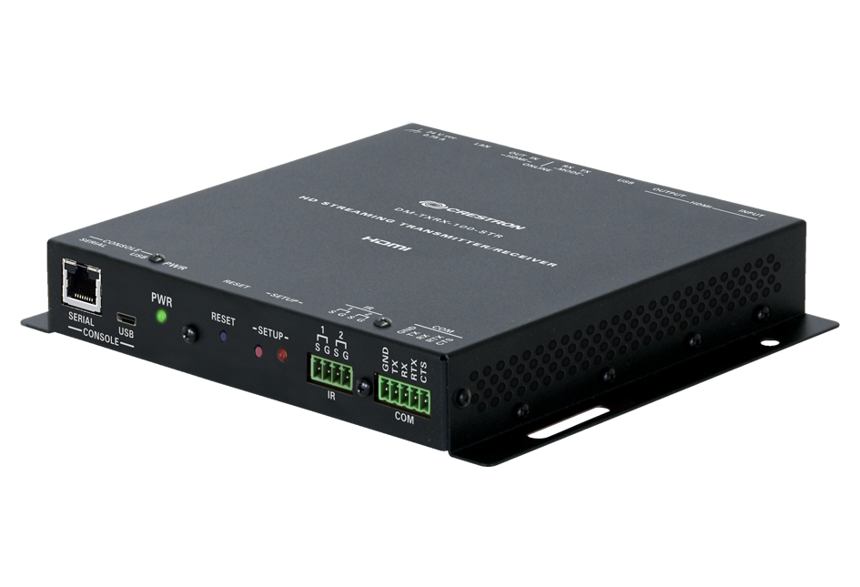
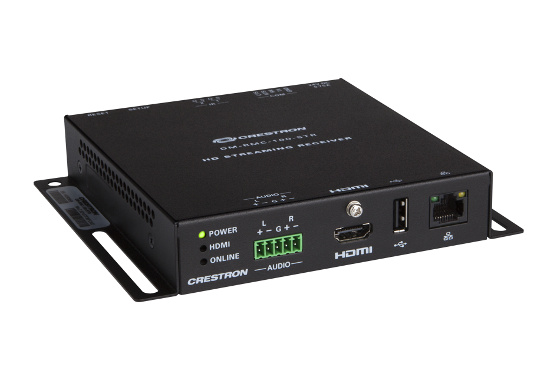

\[caption id="attachment\_474" align="aligncenter" width="650"\] H.264 Streaming Video On The Network\[/caption\]

众所皆知，流媒体技术在远程视频传输中具有更出色的表现。可是用户地处一隅，不容视频的切换操控有任何延迟。幸运的是，快思聪的DM产品完全满足上述要求，可在同一平台上进行零滞后的高速传输、分配无压缩的流媒体视频，用户还可以根据视频种类选择最适切的输入和输出方式。

**带宽决定一切** 一般流媒体解决方案只能应付单一、简单的信号传输，无法达到2K或4K无压缩视频流媒体的要求；而流媒体经压缩处理，令画质受损，这一切都受限于网络的带宽。

市场上其他的流媒体产品占用带宽达到880Mb/s，极高的带宽要求限制了系统在同期可以处理流媒体传送至房间的数量。这也促成了流媒体和带宽管理成为制定网路规则的重要因素。

**流媒体传输无极限** 以上提到的技术性问题，DigitalMedia™都能一一给解决。超乎想象，DM系统只要用上10Mb/s就能传送H.264高质视频，亦可应需求调整带宽使用量，例如以25Mb/s的速度来传输最优质视频、以低于1Mb/s来应对长距离传输或手机应用程序，特别合适于那些带宽十分有限或非常昂贵的地方。只要采用快思聪新品DM，任何网络都能实现无限流媒体传输。

除了模块化矩阵切换器专用的DM流媒体输入和输出卡外，快思聪现已推出高清流媒体发送器/接收器([DM-TXRX-100-STR](http://crestron.com/products/model/DM-TXRX-100-STR))和高清流媒体接收器及房间控制器100 ([DM-RMC-100-STR](http://crestron.com/products/model/DM-RMC-100-STR))。两款成本极低、设计低调的流媒体产品采用PoE供电，尽管在没有切换器或控制系统的房间，都能随时随地轻松调用流媒体功能。

\[caption id="attachment\_475" align="aligncenter" width="945"\] DM-TXRX-100-STR\[/caption\]

**每个房间都能尽情实现流媒体技术** DM-TXRX-100-STR可以当作发送器或接收器独立使用，兼容H.264流媒体编码和译码，特别适用于在IP网路上传送或接收高画质内容，是办公室甚至临时视频会议室等协作空间的理想选择。

DM-TXRX-100-STR可与多款DM产品如3系列DM演示系统([DMPS3-4K-150-C](http://crestron.com/products/model/DMPS3-4K-150-C))或演示切换器([HD-MD8X1-4K](http://crestron.com/products/model/HD-MD8X1-4K)或[DM-MD8X1-4K-C](http://crestron.com/products/model/DM-MD8X1-4K-C)) 或任何一款即将推出的DM发送器全面整合成用途极广、成本低的演示室解决方案。

\[caption id="attachment\_476" align="aligncenter" width="945"\] DM-RMC-100-STR\[/caption\] **实现流媒体即播？** DM-RMC-100-STR是一款简单的支持H.264流媒体传输的房间接收盒兼显示屏控制器，特别适用于公共场所，如大堂、休息室、餐厅或演讲场所或任何需要实现流媒体的地方。其动态图文覆盖能力可应用于数字标牌，或直接把流媒体分布到不同地方的显示屏。对于一些原来已有流媒体输出端的DM切换器或系统，DM-RMC-100-STR是可以完整原来系统的最佳助手。

**“ 友好兼容型＂安装设计** DM-TXRX-100-STR和DM-RMC-100-STR安装方式多样。基于其低调、轻薄的外型，可隐形于平面显示屏或吊装式投影机后、亦可直接安于机架轨、桌底或讲台等家具之后。所有LED信号灯都置于顶部和底部，有助于用户更直观的检视设备运行状态。
