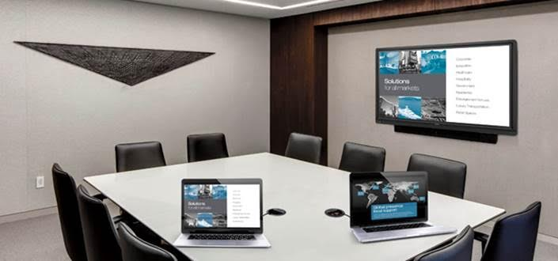
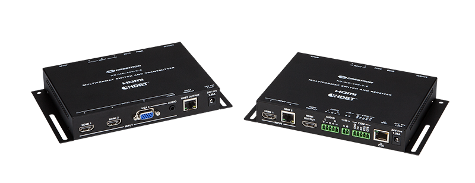

\[caption id="attachment\_506" align="aligncenter" width="705"\] 快思聪极简约、低成本紧凑空间及教室演示解决方案  
现已发售\[/caption\] 快思聪宣布一款全新低成本的HDMI切换器及延长器正式面世，专为小型会议室、紧凑空间和教室提供可靠、专业的演示解决方案。这款由快思聪巧妙设计的高清演示切换器及延长器400 ([HD-MD-400-C-E](https://www.crestron.com/products/model/HD-MD-400-C-E)) 参照业界最高的DM®技术标准精心打造，功能全面，更以突破性价格发售。 **针对小型工作空间的需求** 现时，紧凑空间和小型教室的数量正不断上升，因此设计简洁、功能完善、低成本的多媒体演示解决方案的需求量大幅增加，HD-MD-400-C-E便应时而生。结合HDBaseT®延长器、影像显示倍线器、自动切换器(由高清至2K分辨率)、显示控制器及连接以太网络的一体化设备，外形紧凑小巧，使用便捷。 \[caption id="attachment\_507" align="aligncenter" width="800"\] HD Scaling Presentation Switcher & Extender 400  
HD-MD-400-C-E\[/caption\]

**毋须编程** HD-MD-400-C-E结合了3X1传送器和高清接收器，毋须任何特定编程，即可在数分钟内完成安装。设备适合安装在桌底或讲台之内，包含2个HDMI输入端、1个VGA输入端以及1个模拟音频输入端，可与各类媒体连接，如电脑或移动设备等。亦可将接收器安装在房间显示器後方或投影器上方，作为本地信号源额外的HDMI输入端，如用作接驳Crestron AirMedia™ ([AM-100](https://www.crestron.com/products/model/am-100))无线演示分享介面。 **连线即用** 只要将笔记本电脑或智能设备连接HD-MD-400-C-E的任何一个输入端，即能将影像信号传送至最远230尺(70米)的房间显示器，简单易用。另外，信号自动侦测功能会自行开/关显示器，减少控制面板或遥控器的使用。另外，亦可於显示器或可选的墙装面板加入另一组传送/接收器，这样便可以处理更多的影音信号。 **内置高清倍线器** 不少受欢迎的显示器因无法同时兼容多种影像格式和分辨率，无法满足现实生活中多元化的演示要求，这正是HD-MD-400-C-E设有内建高清倍线器的原因。这种内置式的高清倍线器支持所有数字和模拟信号，可确保所有信号稳定、完美地呈现眼前。当接收器连接显示器後，它便会有条不紊地进行信号转换并提升至最优质格式。 **不只是延长器** 一般高清延长器只能单纯地延长高清信号的传送距离，但HD-MD-400-C-E可以做到更多，因它可与其他快思聪控制系统整合。整个系统可连接Crestron Fusion®企业管理软件，透过以太网络监察、管理和控制每个办公室中的其他设备。管理人员可借助Crestron Fusion、参照技术与工作场所的使用情况，为企业订立精准、合适的数据决策。 **安装低调** 不论是传送器还是接收器外型都非常纤薄精巧，能轻易隐藏在演讲台内、桌底、挂墙显示器後方、吸顶式投影机上方，甚或直接安装在机架导轨。两款设备共用电源配件供电，只需传送器或接收器任一端接通电源，另一端便会自动通过HDBaseT供电，大大提高安装灵活性。 **设定更轻松** 设定时，将接收器的LAN连接以太网络便可经网络浏览器完成配置。设备已配置了一些主要的控制和状态指示器供简单测试和故障排除，所以安装时即使没有接驳电脑仍能顺利完成。
