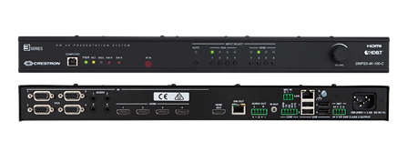

\[caption id="attachment\_580" align="aligncenter" width="706"\] 针对小型房间的3系列4K DigitalMedia™ 演示系统(DMPS3-4K)\[/caption\]

快思聪正式扩充旗下最畅销系列── 3系列4K DigitalMedia演示系统(DMPS3-4K)，加入两款适用于小型空间、连接单一显示器的演示系统。DMPS3-4K系列之产品皆内置3系列控制系统、模拟及数字影音切换功能、4K倍线器，以及用于连接Crestron Fusion®管理软件LAN端口。自设计之初到产品定价，无一不依据单独房间、校园和企业大规模部署的要求，所有DMPS3-4K系列产品都是「开箱即用」，配以简单易用的网路配置和部署功能。

\[caption id="attachment\_581" align="aligncenter" width="447"\] DMPS3-4K系列\[/caption\]

**适合连接单一显示器的应用** DMPS3-4K-50适合处理本地信号和连接本地显示器，而DMPS3-4K-100-C可用于处理本地信号至延伸显示器，DMPS3-4K-150-C则适用于传送远程信号到延伸显示器。每个型号都各有优点，只有DMPS3-4K系列如此一应俱全。 **完善系统　「开箱即用」** 全线DMPS3-4K系列之产品皆内置 .AV Framework™技术，强大功能和实用性之高无出其右。开箱即可体验自动切换、即插即用，轻松连接Connect It™、经CEC控制显示器开关，及通过连接AirMedia®扩展无线简报功能，随时实现BYOD。 **触摸屏或笔記本电脑上轻松完成配置** 系统集成商可在触摸屏或其他网路工具上，以.AV Framework™完成简单的系统设定。甚至无须编程都可点选、分配信号源和对应显示器、触摸屏的GUI即可生成，毫不费力完成设定多个房间，享受直观、一致的使用者体验。要处理更高级的集成和管理，同样可以透过.AV Framework 无须编写任何程序，设定Cresnet占用传感器和快速连接Crestron Fusion。
