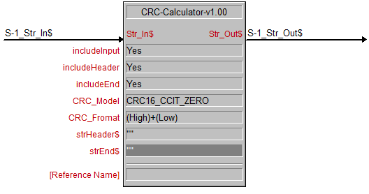

**CRC 校验计算器 CRC-Calculator**

\[caption id="attachment\_599" align="aligncenter" width="528"\] CRC-Calculator-v1.00\[/caption\]

**功能：**

计算字符串的 CRC 值。采用查表式计算 CRC 值，可以节约系统资源的开销。

**设置参数说明：**

includeInput ：输出字符串包含输入字符串，默认：Yes includeHeader ：输出字符串包含 strHeader$ 参数内设置的数据头，默认：Yes includeEnd ：输出字符串包含 strEnd$ 参数内设置的数据尾，默认：Yes CRC\_Model ：CRC 算法模块选择，支持如下 5 种：

> CRC16\_CCIT\_ZERO CRC16\_AUG\_CCITT CRC16\_CCITT\_FALSE CRC16\_MODBUS CRC16\_ARC

CRC\_Fromat：CRC 校验位模式，高位在前还是低位在前，默认：(High)+(Low)\[高位在前\] strHeader$：数据头字符串 strEnd$：数据尾字符串

**下载：** v1.00 [CRC-Calculator-v1.00](https://forum.apcube.com/smart-knowledge/crc-t631.html)
