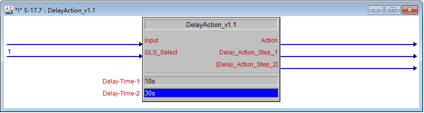

\[caption id="attachment\_654" align="aligncenter" width="847"\] DelayAction\_v1.1\[/caption\]

一个延时操作的宏，输入信号触发时，Action 输出脉冲信号，输入信号结束时，延时 Delay-Time-1 输出脉冲信号 Delay-Action-Step-1 ，延时 Delay-Time-2 ，输出脉冲信号 \[Delay-Action-Step-2\]。

**信号说明：** Input，数字量，信号输入，比如 探测器 等... GLS\_Select，数字量，1/0 输入，默认 1 ，高电平信号触发时置 0 ，低电平信号触发时置 1 ，比如 GLS-ODT/OIR-1000 为低电平触发类 Action、Delay-Action-Step-1/2，脉冲数字量输出 Delay-Time-1/2，时间参数项，允许数值 0~9999999s，默认 10s/30s

**使用场合：** 探测器感应灯光，等...

**版本：** v1.1

**下载：** [DelayAction\_v1.1.7z - 2 KB](https://dailyuploads.net/izir6uumkogw)
