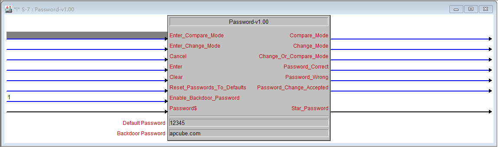
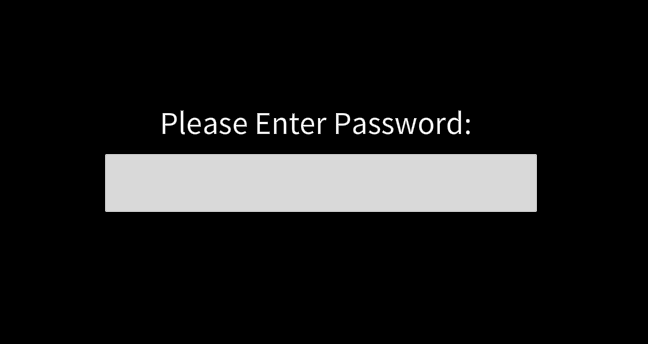

\[caption id="attachment\_661" align="aligncenter" width="1148"\] Password-v1.00\[/caption\]

做了一个适合 3 系界面的密码宏，界面上只要一个输入框就好了，简洁轻松搞定。

\[caption id="attachment\_662" align="aligncenter" width="648"\] xPassword-v1.00\[/caption\]

**测试环境：** Crestron Software:

Crestron Core 3 UI Controls........: 2.11.05.12 C:\\Program Files (x86)\\Crestron\\Cresdb Crestron Database..................: 60.00.006.00 C:\\Program Files (x86)\\Crestron\\Cresdb

Crestron Toolbox...................: 2.42.442.02 C:\\Program Files (x86)\\Crestron\\Toolbox +BPC8 Tool : 1.42.442 C:\\Program Files (x86)\\Crestron\\Toolbox +Complete Shell : 1.42.442 Unavailable +DMTools : 1.42.442 Unavailable +DSP128Shell : 1.42.442 C:\\Program Files (x86)\\Crestron\\Toolbox +Front End : 1.42.442 Unavailable +Minimal Shell : 1.42.442 Unavailable +Procise Tools : 1.42.442 C:\\Program Files (x86)\\Crestron\\Toolbox +Prodigy Tools : 1.42.324 C:\\Program Files (x86)\\Crestron\\Toolbox +Server : 1.42.442 C:\\Program Files (x86)\\Crestron\\Toolbox

Device Database....................: 80.00.002.00 Unavailable SIMPL Windows......................: 4.05.04.00 Unavailable SIMPL Windows Library..............: 508 Unavailable SIMPL+ Cross Compiler..............: 1.3 Unavailable VisionTools Pro-e..................: 6.1.03.00 C:\\Program Files (x86)\\Crestron\\vt\_pro-e

Operating System:

Windows Version: Microsoft Windows 10 专业版 IE Version: 9.11.14393 CPU: Intel(R) Core(TM) i7-3537U CPU @ 2.00GHz (x4) @ 2494 MHz Physical Memory: 1186 MB / 3877 MB Virtual Memory: 1823 MB / 2047 MB Admin Rights: Yes DPI: X:96 Y:96 Scaling Factor: 100 UAC Enabled: True Virtualization Enabled: True

**下载：** v1.00 [Password-v1.00.7z - 6 KB](https://dailyuploads.net/8w1lz0phep9g)

示例程序： [Password-Login.7z - 737 KB](https://dailyuploads.net/68uxrlj0rdaf)
